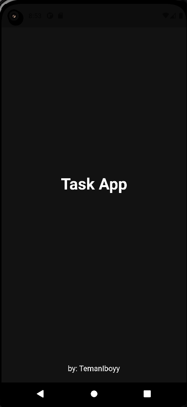
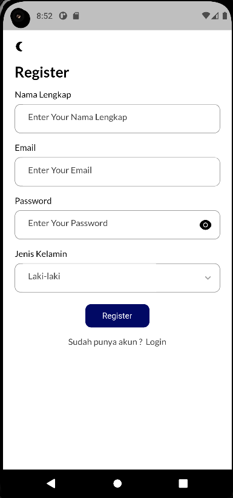
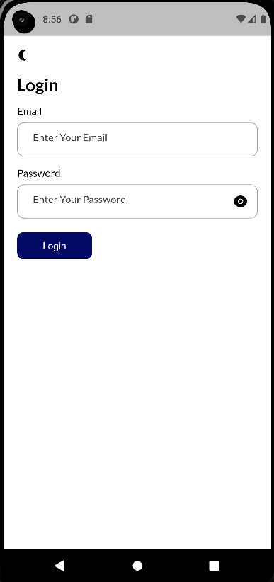
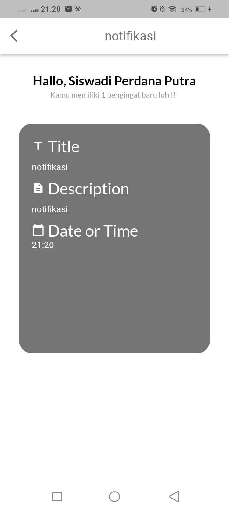

<h1 align="center">
  Simple Task Management
</h1>

## Konten
- [Pengenalan](#pengenalan)
- [Installasi](#Cara-Instalasi-dan-Menjalankan-di-Local-Komputer)
- [Hasil Gambar](#Hasil-Gambar)
- [Fitur](#Fitur)
- [Teknologi Yang digunakan](#Teknologi-yang-digunakan)
- [Dependensi](#Dependensi)
- [Kontak](#Kontak)

## Pengenalan
Hallo everyone, ini adalah salah satu hasil kerja dan tugas saya bersama teman saya [Farhan](https://www.linkedin.com/in/farhan-mirza-banazi-510907236/) untuk menyelesaikan mata kuliah pemrograman mobile, disini kami membagi tugas dan tanggungjawab yang harus dikerjakan oleh masing-masing orang, untuk tugasnya sebagai berikut:
- Siswadi Perdana Putra
  - Membuat UI
  - Membuat Login Page
  - Membuat Register Page
  - Membuat Form Add Task
  - Membuat Notifikasi Task dan halamannya
- Farhan Mirza Banazi
    - Membuat UI
    - Membuat Splash Screen
    - Membuat Home Page

## Cara Instalasi dan Menjalankan di Local Komputer
1. Lakukan persiapan terlebih dahulu seperti instalasi framework flutter, dart SDK, Text Editor(VS Code, Atom, Android Studio), Java JDK dan yang lainnya, setelah semuanya ter-install silahkan buka `cmd` lalu ketikka `flutter doctor` untuk memastikan semuanya sudah sesuai, jika semuanya sesuai maka akan seperti pada gambar dibawah ini <br>
 <br> tolong hiraukan tanda silang tersebut karena tidak berpengaruh
2. Lakukan Clone atau Download pada link disini(```https://github.com/Siswadi24/Coffe-App-UI-Dark.git)```
3. kemudian buka pada text editor anda masing-masing. 
4. Menuju file `pubspec.yaml` lalu lakukan `Ctrl + S` atau tekan tombol download di sebelah kanan atas seperti pada gambar dibawah ini<br>
5. Jalankan menggunakan perintah `flutter run` atau bisa menuju dokument `main.dart` lalu klik tombol `Debug` seperti pada gambar dibawah<br><br>
__*Jika masih bingung silahkan kunjungi website ini [cara menjalankan projek flutter dilocal komputer menggunakan Vs Code](https://piusaditya.medium.com/cara-clone-flutter-project-dari-github-menggunakan-visual-studio-code-3e165c2bef98)*__


## Hasil Gambar
Splash Screen | Register Screen | Login Screen | Home Screen | Add Task Screen | Notifikasi Screen
:----------:|:----------:| :----------:| :----------:| :----------:| :----------:
 |  |  |  |  | 
## Fitur
- Splash Screen
- Register Screen
- Login Screen
- Home Screen
- Add Task Screen
- Notifikasi Screen

## Teknologi yang digunakan
- Flutter
- Dart

## Dependensi
- [get_storage](https://pub.dev/packages/get_storage)
- [get](https://pub.dev/packages/get)
- [flutter_local_notifications](https://pub.dev/packages/flutter_local_notifications)
- [flutter_native_timezone_updated_gradle](https://pub.dev/packages/flutter_native_timezone_updated_gradle)
- [google_fonts](https://pub.dev/packages/google_fonts)
- [timezone](https://pub.dev/packages/timezone)
- [intl](https://pub.dev/packages/intl)
- [date_picker_timeline](https://pub.dev/packages/date_picker_timeline)
- [sqflite](https://pub.dev/packages/sqflite)
- [flutter_staggered_animations](https://pub.dev/packages/flutter_staggered_animations)
- [flutter_svg](https://pub.dev/packages/flutter_svg)

## Kontak
Jika anda memiliki pertanyaan atau memiliki permasalahan dalam hal menjalankan atau yang lainnya, silahkan hubungi saya melalui email di *danaperdanaputra32@gmail.com* atau di [LinkedIn](https://www.linkedin.com/in/siswadi-perdana-putra-0b670a22b/)